General useful information about XNAT by the NCITA team  

# **1.- XNAT INSTALLATION**  
These are notes documenting the experience of installing XNAT, hints and tips of the journey.  

**1.1 Full installation**  
As described [here](https://wiki.xnat.org/documentation/getting-started-with-xnat/xnat-installation-guide)  

* A - Debian  
Summary of versions (November 2019):  

Package | Version | Other
------------ | ------------- | -------------
Debian GNU/Linux OS | 9.6 (stretch) | x86_64 architecture 
Java (openjdk) | 1.8.0_232 | apt
PSQL (PostgreSQL) | 9.6.15 | apt
Tomcat 7 | 7.0.96 | From .tar.gz
XNAT | 1.7.5.6 | From .war   

_Tip_: lsb_release command prints out LSB (Linux Standard Base) and Distribution information. Example usage: 
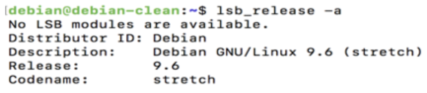

*** **Install Prerequisites** ***   
Note: Will be using APT (Advanced Packaging Tool) to install packages when possible   
_Tip_: Always run ‘apt update’ to start with, to refresh the repository index (i.e. to be able to find latest packages and updates)   
_Hint_: Some of the instructions below required root/administrator access, e.g. _apt_ -> _sudo apt_ or run _sudo -i_  
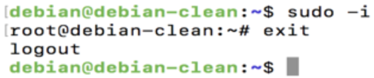  

**- Java**  
Note: There are two Java packages: i) Java Runtime Environment (JRE) and ii) Java Development Kit (JDK). JRE might be all you need if you only want to run Java programs, but if you are going to do any development work, then you need JDK which includes development and debugging tools and libraries.  
**For XNAT, Java JDK is needed - currently recommended Java version 8**  
Run _sudo apt install openjdk-8-jdk_  
This will install a number of packages, amongst which you can find also openjdk-8-jre  
_Tip_: Use completion tab to see which packages are available.   
If all goes well, you can check if java is installed:   
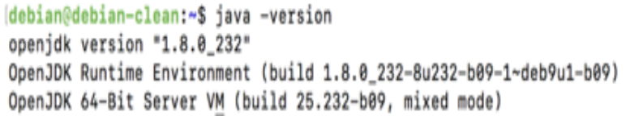	

**- PostgreSQL**
Use instructions [here](https://www.postgresql.org/download/linux/debian/)  
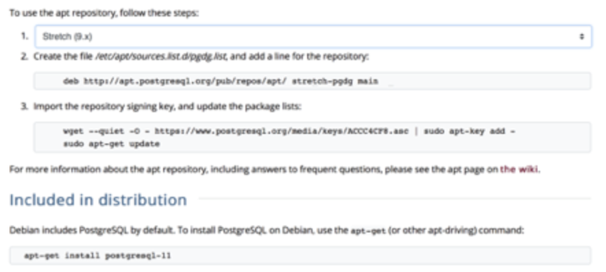  
_Tip_: The website above says that “Debian includes PostgreSQL by default”. In my case however, in my server this didn’t seem to be the case. You can check by requesting the version _psql --version_  
_Tip_: The website above also says that version 11 should be available with apt, however it might not be the case (make sure you do _sudo apt update_ before trying!)  
From XNAT installation page: <q>strongly recommend installing XNAT 1.7 on 9.4 or later from the start<q> - So I decided to use the latest version available with apt (remember the tab completion!) that turned out to be in my case 9.6. Check which versions are compatible with your distribution in the website above: 
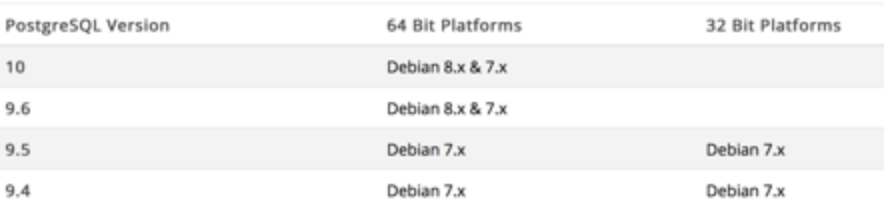  
Although not publicised to work with Debian 9, I testify PSQL 9.6 worked for me.  
Run: _sudo apt install postgresql-9.6_  
If it all worked fine, now you should be able to check the version now.  

**- Tomcat 7**  
_Note_: You might find that only Tomcat 8 seems available with APT. Please notice the XNAT team warning: <q>We have had some success running under Tomcat 8, but there are known issues with some combinations of different versions of the JDK and Tomcat 8 that we have not been able to fully pin down. Running under Tomcat 8 is possible but is at your own risk until we can fully test and quantify the issues on that platform.<q> In my case, I run into troubles with Tomcat 8 when I first tried (it might have been my fault, but to ping it down is still to be done). So this is how I finally installed Tomcat 7. 
_Note_: Installing it in this way makes things slightly different than expected (from documentation), still to be seen no problems arise later! Reason is there will be nothing in /var/lib or /usr/share and no _service tomcat7 start_ or _service tomcat7 stop_ is possible, instead you can use _sudo /opt/tomcat7/bin/startup.sh_ or _sudo /opt/tomcat7/bin/shutdown.sh_  
Following documentation like for example [here](https://tecadmin.net/install-tomcat-7-on-ubuntu/), I installed it by downloading the tar.gz file from [this link](https://tomcat.apache.org/download-70.cgi)  
Run:   
_cd /opt/_  
_sudo wget http://apache.mirrors.nublue.co.uk/tomcat/tomcat-7/v7.0.96/bin/apache-tomcat-7.0.96.tar.gz_  
_sudo tar -zxvf apache-tomcat-7.0.96.tar.gz_  
_sudo mv apache-tomcat-7.0.96 tomcat7_  
Configure:  
_echo "export CATALINA_HOME="/opt/tomcat7"" >> ~/.bashrc_  
_source ~/.bashrc_  
Test:  
_cd tomcat7/bin/_  
_sudo ./startup.sh_  
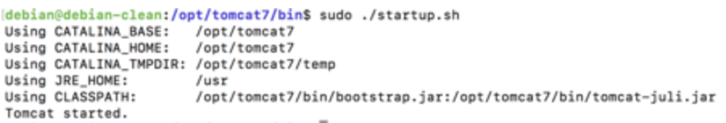  
This should make it possible to reach http://localhost:8080   
_Tip_: make sure port 8080 is open!   
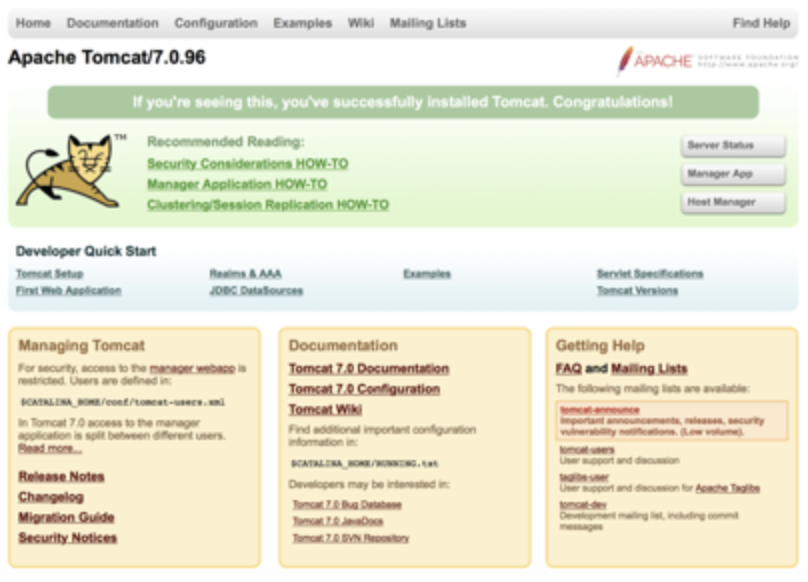  

** XNAT **  

Create XNAT folders   
_sudo mkdir /data/_  
_sudo mkdir /data/xnat_  
_sudo mkdir /data/xnat/home_  
_sudo mkdir /data/xnat/archive_  
_sudo mkdir /data/xnat/prearchive_  
_sudo mkdir /data/xnat/build_  
_sudo mkdir /data/xnat/cache_  
_sudo mkdir /data/xnat/ftp_  
_sudo mkdir /data/xnat/home/config_  
_sudo mkdir /data/xnat/home/logs_  
_sudo mkdir /data/xnat/home/plugins_  
_sudo mkdir /data/xnat/home/work_  
Configure PSQL, create user and database for xnat:  
_sudo su - postgres -c <q>createuser -D xnat<q>_    
_sudo su - postgres -c <q>createdb -O xnat xnat<q>_    
_sudo su - postgres -c <q>psql -c \<q>ALTER USER xnat WITH PASSWORD 'xnat'\<q>_  
Configure Tomcat to find /xnat/home   
_CATALINA_OPTS=<q>${CATALINA_OPTS} -Dxnat.home=/data/xnat/home<q>_  
_JAVA_OPTS=<q>${JAVA_OPTS} -Dxnat.home=/data/xnat/home<q>_  

_Tip_: In my case, I learnt that my catalina/java environmental options get cleaned up every time I shutdown and start tomcat. The way to avoid this is to edit or create bin/setenv.sh. Mine is very simple to start with, it only contains:   
``` #!/bin/bash                                                                                                                                                                                                                                     
CATALINA_OPTS="${CATALINA_OPTS} -Dxnat.home=/data/xnat/home"
JAVA_OPTS="${JAVA_OPTS} -Dxnat.home=/data/xnat/home"
 
CATALINA_OPTS="${CATALINA_OPTS} -Xms512m -Xmx1024m -XX:MaxPermSize=256m"
JAVA_OPTS="${JAVA_OPTS} -Xms512m -Xmx512m" ```

Get a WAR XNAT file in the Tomcat webapps folder. For example:   
```cd /opt/tomcat7/webapps/  
sudo wget https://api.bitbucket.org/2.0/repositories/xnatdev/xnat-web/downloads/xnat-web-1.7.5.6.war```  
Now if we move the xnat war file to ROOT.war, Tomcat will deploy this as the default website when re-started:   
```sudo mv xnat-web-1.7.5.6.war ROOT.war  
sudo ../bin/shutdown.sh  
sudo ../bin/startup.sh```  
_Tip_: There is already a ROOT directory by default (creating the web with the Tomcat logo above), which you need to remove or rename: _sudo mv ROOT default_  
_Note_: Probably now http://localhost:8080 will refuse to connect!   
_Tip_: The two places to look for log files with possible errors are /opt/tomcat7/logs/ and /data/xnat/home/logs/  
_Hint_: the most likely thing to happen is that you need to increase the memory! This is what the two bottom lines mean in the setenv.sh script above!   
_Tip_: Dont forget to create the xnat-conf.properties file! (like default version of [this file](https://wiki.xnat.org/documentation/files/28049512/31097236/1/1474655936338/xnat-conf.properties))   
_Tip_: For newer versions of XNAT, use git clone (you might run into problems if you try through api.bitbucket.org):  
_git clone git@bitbucket.org:xnatdemo/demo_war.git_ or _git clone https://bitbucket.org/xnatdemo/demo_war.git_  should get the latest 1.7.6 at the time of writing.  
If the above worked, you should be able to reach your XNAT now in a web browser (I have tested Safari and Chrome) Should look like this, and have admin/admin login keys to start with. _Note_: the first time it might take a while to load in the web browser, as Tomcat is deploying it for the first time.   
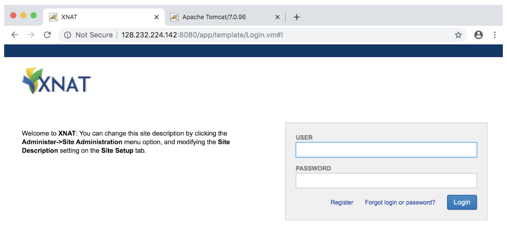

**Install the pipeline**  
Instructions [here](https://wiki.xnat.org/documentation/getting-started-with-xnat/installing-the-pipeline-engine). _Note_: you can still access your XNAT without installing the pipeline, but you will see an error message on the top complaining about the pipeline path not found.   
_Tip_: If you start in a distribution of Debian, etc. from scratch, you may need to install git, simply: _sudo apt install git_  
```git clone https://www.github.com/nrgXnat/xnat-pipeline-engine.git (latest pipeline)  
mkdir /data/xnat/pipeline  
cd xnat-pipeline-engine/  
emacs -nw gradle.properties```   Use your preferred text editor! and add the following:   
```xnatUrl=http://http://128.232.224.142:8080/                                                                                   
siteName=XNAT
adminEmail=les44@cam.ac.uk
smtpServer=smtp.hermes.cam.ac.uk
destination=/data/xnat/pipeline```
Then do 
```./gradlew ```
_Tip_: gradlew needs to create directories and copy files, so you might need to run it as sudo (if you see some errors e.g. <q>> Task :copyBuildInfo FAILED<q>)  
_Note_: Making xnat as user owner of the different folders, e.g. _chown -R xnat:xnat /data_ fails for me, however it doesnt seem to be mandatory as the rest of the installation works fine.  


# **2.- XNAT CONFIGURATION**  

**2.1 First time configuration**  
When you login for the first time, you will be asked to change certain things (like admin/admin)   
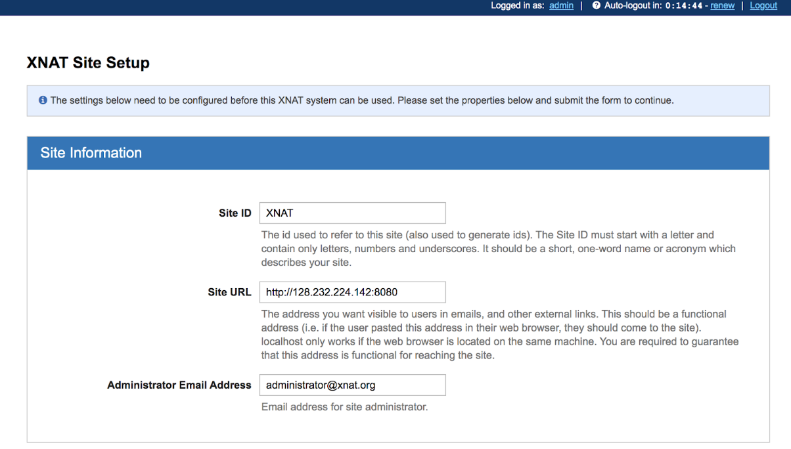  
Make changes to the site setup, such as admin email, stmp, url. Then click on admin (top right, Logged in as: admin) and change email and password:  
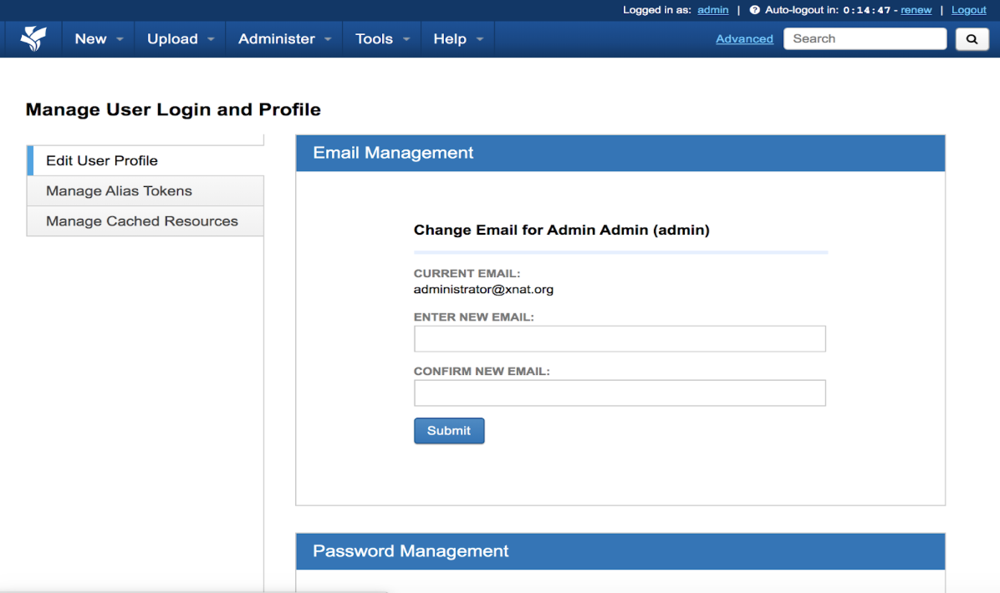  
_Tip_: Check you have a Mail User Agent install (e.g. exim4 and postfix) and this [post] (https://kifarunix.com/configure-postfix-to-use-gmail-smtp-on-ubuntu-18-04/) by Rick Herrick, XNAT team, in Google groups gives some tips.   
Once you register, then log in as a user, create a new project, and try to upload some images, for example by downloading and using XNAT Upload Assistant.   
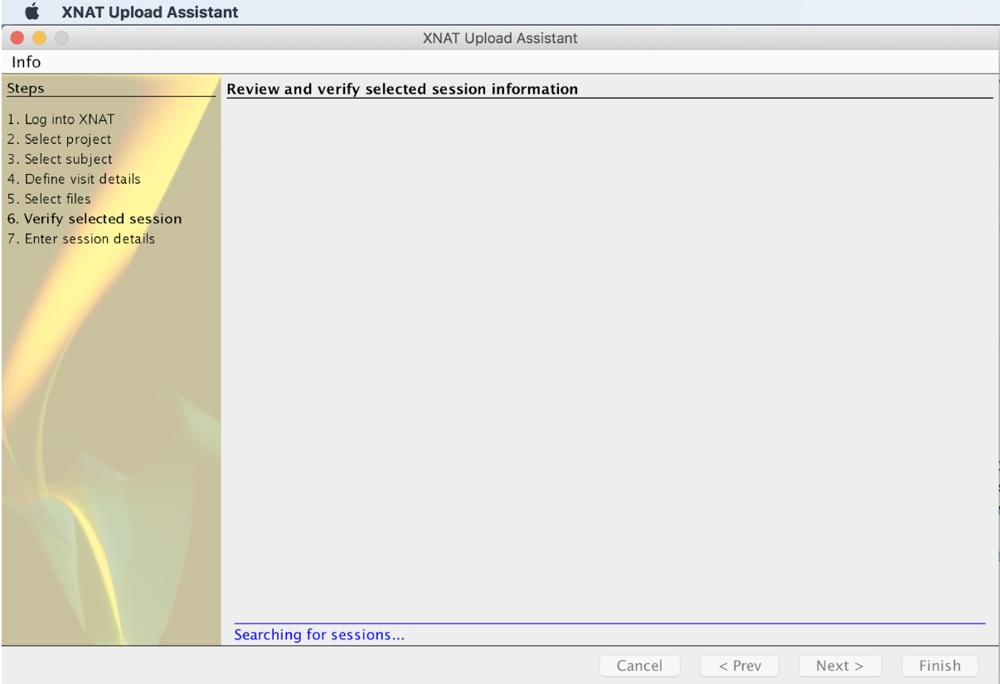   
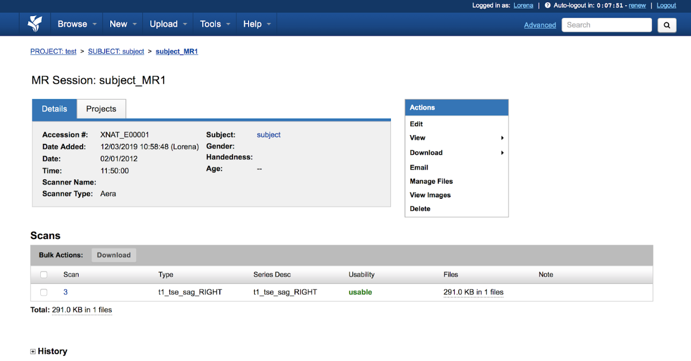   


# **3.- USEFUL LINKS AND REFERENCES **  
Google groups forum (xnat_discussion) where people ask questions to the xnat team and community: https://groups.google.com/forum/#!forum/xnat_discussion    


 


